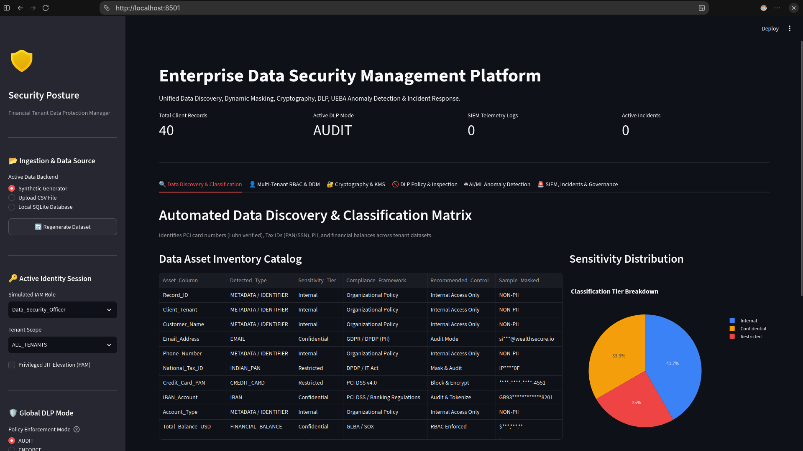
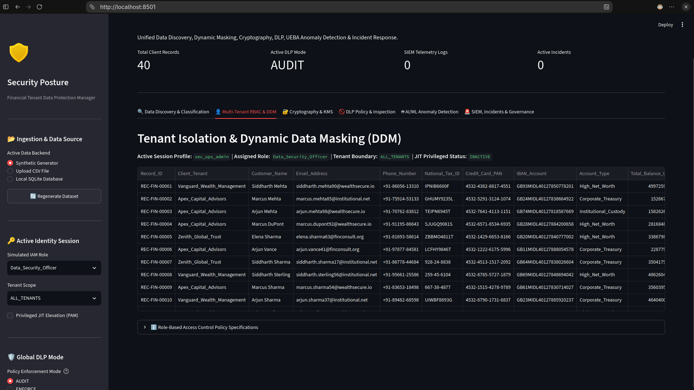
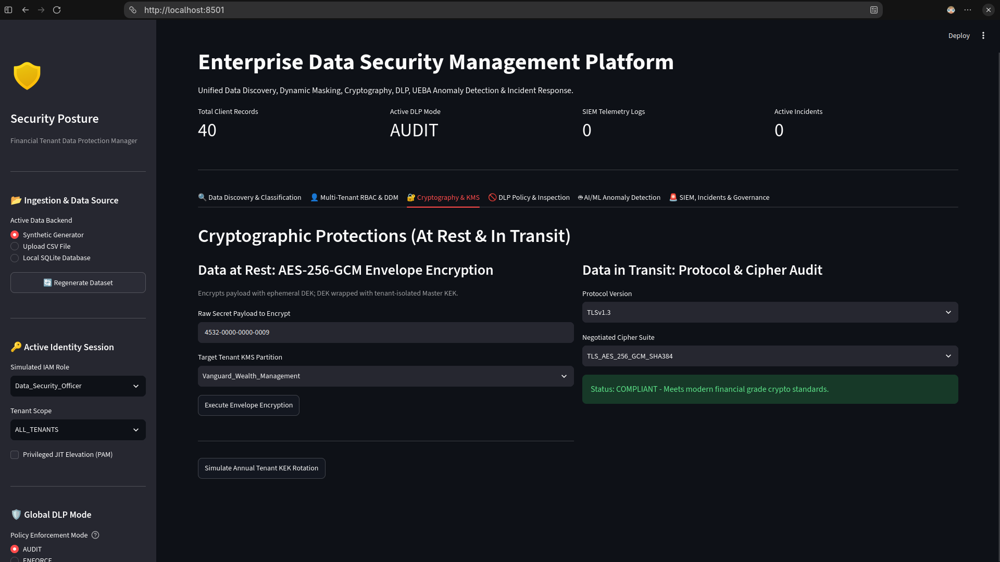
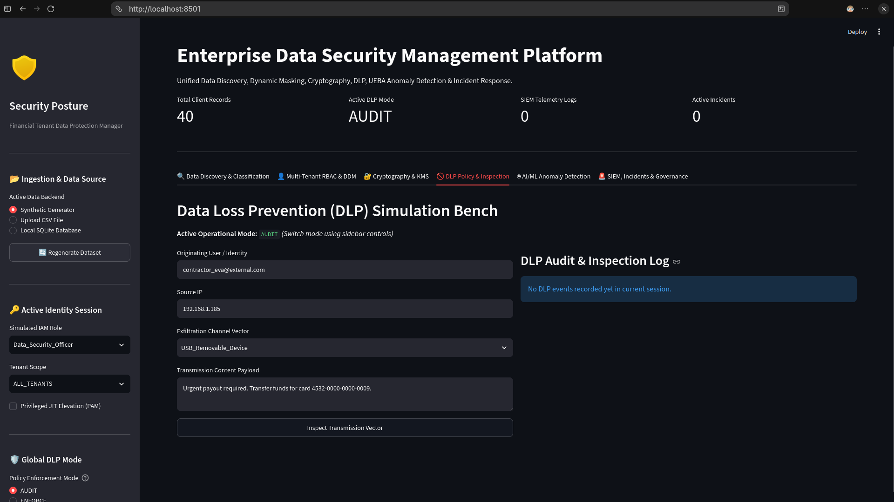
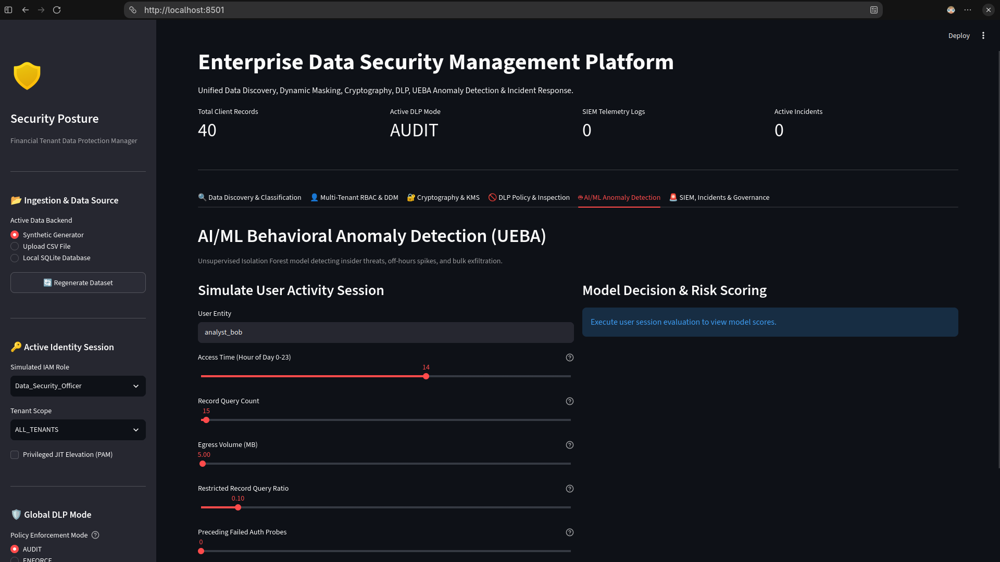
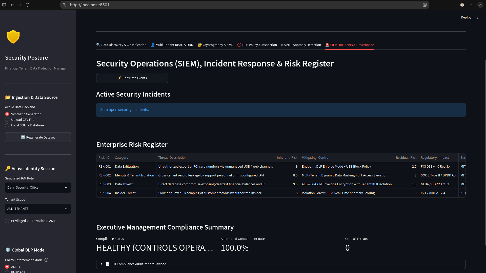

# 🛡️ Enterprise Data Security Manager (Financial Services)

[](https://www.python.org/)
[](https://streamlit.io/)
[](https://scikit-learn.org/)
[](https://cryptography.io/)
[]()
[](https://getfedora.org/)

A unified **Data Security Posture Management (DSPM)**, **Data Loss Prevention (DLP)**, and **Security Information & Event Management (SIEM)** platform designed for multi-tenant financial-services architectures.

The platform provides end-to-end, data-centric security capabilities across the data lifecycle, including:

* Automated data discovery and sensitivity classification
* Multi-tenant Role-Based Access Control (RBAC)
* Dynamic field-level data masking
* AES-256-GCM envelope encryption
* Tenant-isolated key management
* Data Loss Prevention (DLP)
* User and Entity Behavior Analytics (UEBA)
* Machine-learning-based anomaly detection
* SIEM event correlation
* Automated incident-response playbooks
* Security governance and risk tracking

---

## 🏗️ Architecture & Data Flow

```text
┌──────────────────────────────────────────────────────────────────────┐
│            Ingestion Engine: Synthetic / CSV / SQLite DB             │
└───────────────────────────────────┬──────────────────────────────────┘
                                    │
                                    ▼
┌──────────────────────────────────────────────────────────────────────┐
│                 Data Discovery & 4-Tier Classification                │
│                 Luhn Check • Regex • Regulatory Mapping               │
└───────────────────────┬──────────────────────────┬───────────────────┘
                        │                          │
                        ▼                          ▼
             ┌─────────────────────┐    ┌─────────────────────────┐
             │ Multi-Tenant RBAC   │    │ AES-256-GCM Envelope    │
             │ & Dynamic Masking   │    │ Encryption & KMS        │
             └─────────────────────┘    └─────────────────────────┘
                        │
                        │
                        ▼
             ┌─────────────────────────┐
             │ Data Loss Prevention    │
             │    DLP: Audit/Enforce   │
             └────────────┬────────────┘
                          │
                          ▼
             ┌─────────────────────────┐
             │ AI/ML UEBA Anomaly      │
             │   Isolation Forest      │
             └────────────┬────────────┘
                          │
                          ▼
             ┌─────────────────────────┐
             │ SIEM Correlation &      │
             │ Incident Response       │
             │ Governance & Risk       │
             └─────────────────────────┘
```

---

# 🌟 Core Security Pillars & Features

## 1. Automated Discovery & Classification

The discovery engine identifies potentially sensitive financial and personal information and assigns data to a four-tier sensitivity model.

### Luhn Algorithm Validation

The platform uses the **Luhn checksum algorithm** to validate candidate Primary Account Numbers (PANs) and reduce false positives when scanning arbitrary numeric data.

### Context-Aware Detection

The discovery engine can identify sensitive information such as:

* Primary Account Numbers (PANs)
* Tax IDs
* US Social Security Numbers (SSNs)
* IBAN account numbers
* Confidential transaction information
* Other sensitive patterns detected through regular expressions

### Four-Tier Classification

Detected information is categorized into:

| Classification      | Description                                                   |
| ------------------- | ------------------------------------------------------------- |
| 🔴 **Restricted**   | Highly sensitive information requiring the strongest controls |
| 🟠 **Confidential** | Sensitive business or customer information                    |
| 🟡 **Internal**     | Information intended for internal organizational use          |
| 🟢 **Public**       | Information suitable for public access                        |

The classification model is mapped against the project's stated PCI DSS, DPDP Act, and GDPR security requirements.

---

## 2. Multi-Tenant RBAC & Dynamic Data Masking

The platform implements logical tenant isolation and role-based access controls for financial-service environments.

### Tenant Isolation

Queries and data access are restricted according to the user's assigned client or tenant boundary.

Example tenants include:

* Apex Capital Advisors
* Vanguard Wealth Management

### Role-Based Data Visibility

| Role                      | Access Model                                                             |
| ------------------------- | ------------------------------------------------------------------------ |
| **Data Security Officer** | Full visibility with Just-In-Time (JIT) elevation logging                |
| **Compliance Auditor**    | Cross-tenant views with restricted-token masking                         |
| **Financial Analyst**     | Scoped client access with balances visible and card information redacted |
| **Tier 1 Support**        | Scoped client access with balances and PII masked                        |

Dynamic field-level masking ensures that sensitive values are exposed only when permitted by the applicable role.

---

## 3. Cryptographic Engine & Key Management Service

The cryptographic engine provides authenticated encryption and tenant-isolated key-management functionality.

### AES-256-GCM Envelope Encryption

Records are encrypted using:

* AES-256-GCM
* 256-bit Data Encryption Keys (DEKs)
* 96-bit nonces
* Envelope-encryption architecture

The architecture separates data encryption keys from key-encryption keys.

### Tenant-Isolated Key Management

The platform models tenant-specific Key Encryption Keys (KEKs) used to wrap Data Encryption Keys.

The design also supports key rotation without requiring application-wide downtime.

### Transport Security Analysis

The platform evaluates transport protocols and cipher suites and identifies insecure protocols such as:

* HTTP
* SSLv3
* TLS 1.0

The project architecture targets **TLS 1.3** with **Perfect Forward Secrecy (PFS)** for secure transport.

---

## 4. Dual-Mode Data Loss Prevention (DLP)

The DLP engine inspects potential data-egress channels and supports two operational modes.

### Egress Vector Coverage

The project models monitoring for:

* USB removable media
* Web-browser uploads
* SMTP/email dispatch
* Clipboard operations
* Unapproved SaaS synchronization

### AUDIT Mode

In **AUDIT** mode:

1. Payloads are evaluated.
2. Potential policy violations are logged.
3. Alerts are forwarded to the security-event pipeline.
4. Traffic is allowed to continue.

This mode is intended to provide visibility and establish operational baselines.

### ENFORCE Mode

In **ENFORCE** mode:

1. Payloads are inspected.
2. Restricted information triggers a policy violation.
3. The corresponding transmission is blocked.
4. Security events can be forwarded to the SIEM pipeline.

---

## 5. AI/ML Anomaly Detection (UEBA)

The platform uses an unsupervised **Isolation Forest** model from scikit-learn to analyze user and entity behavior.

### Behavioral Telemetry

The anomaly-detection pipeline analyzes factors such as:

* Access hours
* Query frequency
* Egress volume in MB
* Sensitive-record ratios
* Failed authentication attempts

### Isolation Forest

The model is designed to identify unusual behavioral patterns without requiring a labeled attack dataset.

Potential use cases represented by the project include:

* Insider-threat detection
* Compromised-account detection
* Abnormal data access
* Slow-and-low data-exfiltration behavior

### Dynamic Risk Scoring

Model outputs are normalized into a **0–100 threat score** and categorized into:

| Risk Level | Classification    |
| ---------- | ----------------- |
| 0–24       | `NORMAL`          |
| 25–49      | `ELEVATED`        |
| 50–74      | `SUSPICIOUS`      |
| 75–100     | `CRITICAL_THREAT` |

> The exact scoring boundaries should remain synchronized with the implementation if the project's code uses different thresholds.

---

## 6. SIEM, Incident Response & Governance

The SIEM and incident-response layer correlates security telemetry from multiple engines.

### Multi-Vector Correlation

The platform can correlate events such as:

```text
UEBA anomaly
      +
DLP policy violation
      ↓
Correlated Security Incident
      ↓
Incident Response Playbook
```

For example, an abnormal user-behavior alert combined with a blocked DLP event can be correlated into a single security incident.

### Automated Containment

The project includes operational containment actions such as:

```text
REVOKE_ACTIVE_SESSIONS
QUARANTINE_USER_ACCOUNT
```

### Risk Register

The governance layer maintains:

* Inherent risk
* Residual risk
* Security incidents
* Regulatory compliance information
* Incident-response activity

---

# 🛠️ Technology Stack

| Domain                   | Technology / Library             | Purpose                                |
| ------------------------ | -------------------------------- | -------------------------------------- |
| **Interface / UI**       | Streamlit                        | Interactive SOC console                |
| **Visualization**        | Plotly Express / Graph Objects   | Metrics, gauges, and charts            |
| **Data Processing**      | Pandas                           | DataFrame processing and normalization |
| **Numerical Processing** | NumPy                            | Numerical operations                   |
| **Cryptography**         | `cryptography` / `AESGCM`        | Authenticated AES-256-GCM encryption   |
| **Machine Learning**     | scikit-learn / `IsolationForest` | Behavioral anomaly detection           |
| **Database**             | SQLite3                          | Local persistent storage               |
| **Data Ingestion**       | CSV parsers                      | External/sample dataset ingestion      |
| **Testing**              | Python `unittest`                | Automated security verification        |

---

# 📂 Project Structure

```text
data_security_manager/
│
├── app.py
├── requirements.txt
├── test_security_suite.py
├── client_financial_records.csv
├── financial_data.db
│
├── modules/
│   ├── __init__.py
│   ├── data_engine.py
│   ├── discovery_classifier.py
│   ├── iam_rbac.py
│   ├── crypto_engine.py
│   ├── dlp_engine.py
│   ├── anomaly_detector.py
│   └── siem_ir.py
│
└── docs/
    └── screenshots/
```

### Module Responsibilities

| File                              | Responsibility                                           |
| --------------------------------- | -------------------------------------------------------- |
| `app.py`                          | Streamlit multi-tab SOC operations console               |
| `requirements.txt`                | Python project dependencies                              |
| `test_security_suite.py`          | Automated security verification                          |
| `client_financial_records.csv`    | Sample financial dataset                                 |
| `financial_data.db`               | Seeded SQLite database                                   |
| `modules/data_engine.py`          | Synthetic data generation and CSV/SQLite loading         |
| `modules/discovery_classifier.py` | Regex detection, Luhn validation, and classification     |
| `modules/iam_rbac.py`             | Tenant isolation, RBAC, and dynamic masking              |
| `modules/crypto_engine.py`        | AES-256-GCM envelope encryption and key-management logic |
| `modules/dlp_engine.py`           | Egress inspection and AUDIT/ENFORCE policies             |
| `modules/anomaly_detector.py`     | Isolation Forest-based UEBA analysis                     |
| `modules/siem_ir.py`              | SIEM correlation, incident response, and risk register   |

---

# 🚀 Installation & Setup

## Prerequisites

The project is designed for Linux environments and requires:

* Python 3.10 or newer
* `pip`
* `venv`
* Git

---

## 1. Clone the Repository

Replace the placeholder repository URL with your actual GitHub repository.

```bash
git clone https://github.com/pradun-oops/data_security_manager.git
cd data-security-manager
```

---

## 2. Create a Virtual Environment

```bash
python3 -m venv .venv
```

Activate it:

```bash
source .venv/bin/activate
```

---

## 3. Upgrade pip

```bash
python -m pip install --upgrade pip
```

---

## 4. Install Dependencies

```bash
pip install -r requirements.txt
```

---

# 🧪 Security Verification

Before launching the Streamlit interface, run the automated security test suite:

```bash
python3 test_security_suite.py
```

The supplied project documentation indicates a nine-test suite with an expected successful result similar to:

```text
Ran 9 tests in 0.154s

OK
```

The exact execution time will vary depending on the system.

---

# ▶️ Running the Application

Launch the Streamlit application:

```bash
python3 -m streamlit run app.py
```

By default, Streamlit serves the application at:

```text
http://localhost:8501
```

Open the displayed local URL in your web browser.

---

# 📸 Dashboard Walkthrough

Store application screenshots inside:

```text
docs/screenshots/
```

Suggested dashboard documentation:

## Tab 1 — Data Discovery & Classification

Inspects tabular and free-form data, applies pattern detection and Luhn validation, and visualizes the resulting sensitivity distribution.



---

## Tab 2 — Multi-Tenant RBAC & Dynamic Data Masking

Demonstrates logical tenant isolation, role-based access control, field-level masking, and JIT privilege elevation.



---

## Tab 3 — Cryptography & Key Management

Demonstrates:

* AES-256-GCM encryption
* Envelope-encryption architecture
* Data Encryption Keys (DEKs)
* Tenant-specific Key Encryption Keys (KEKs)
* Key rotation
* Transport-security analysis


---

## Tab 4 — Data Loss Prevention

Tests high-risk egress scenarios and demonstrates both:

* `AUDIT`
* `ENFORCE`

operational modes.


---

## Tab 5 — AI/ML Anomaly Detection

Simulates user behavioral sessions and evaluates anomalies using the Isolation Forest UEBA model.


---

## Tab 6 — SIEM, Incident Response & Governance

Correlates security telemetry from the DLP and UEBA components, triggers configured containment playbooks, and maintains the project's risk register.



---

# 🏢 Enterprise Production Alignment

The following table describes how the prototype's components correspond conceptually to enterprise security-product categories.

| Capability                   | Prototype Implementation  | Example Enterprise Products                        |
| ---------------------------- | ------------------------- | -------------------------------------------------- |
| **DSPM & Classification**    | `discovery_classifier.py` | BigID, Securiti, Microsoft Purview                 |
| **Identity & Data Masking**  | `iam_rbac.py`             | CyberArk, Okta, Snowflake Dynamic Data Masking     |
| **KMS & At-Rest Encryption** | `crypto_engine.py`        | AWS KMS, HashiCorp Vault, Thales Luna HSM          |
| **Endpoint / Network DLP**   | `dlp_engine.py`           | Trellix DLP, Broadcom/Symantec DLP, Zscaler        |
| **UEBA Machine Learning**    | `anomaly_detector.py`     | Exabeam, Securonix, Microsoft Sentinel UEBA        |
| **SIEM & Incident Response** | `siem_ir.py`              | Splunk Enterprise Security, Palo Alto Cortex XSOAR |

> These are conceptual technology mappings rather than claims of feature parity or interoperability with the listed commercial products.

---

# ⚖️ Regulatory Compliance Mapping

The following matrix documents the compliance areas referenced by the project.

| Framework            | Target Requirement                            | Platform Implementation                                               |
| -------------------- | --------------------------------------------- | --------------------------------------------------------------------- |
| **PCI DSS v4.0**     | Requirement 3.4 — Protect stored account data | AES-256-GCM envelope encryption, Luhn validation, and DLP controls    |
| **DPDP Act (India)** | Section 8 — Obligations of Data Fiduciary     | Logical tenant isolation, PAN/Tax-ID masking, and access logging      |
| **GDPR**             | Article 32 — Security of Processing           | Pseudonymization, transport-security checks, and dynamic data masking |
| **GLBA / SOX**       | Safeguards / Internal Controls                | Audit trails, DLP policies, and incident escalation                   |

> This project is a technical prototype and should not be treated as evidence of regulatory compliance or certification. Actual compliance depends on the complete organizational environment, policies, controls, procedures, audit evidence, and applicable legal requirements.

---

# 🔐 Security Considerations

This project handles concepts involving financial records, credentials, personal information, encryption keys, and security telemetry.

When using the project:

* Do not use real customer financial information.
* Do not commit secrets, API keys, passwords, or encryption keys to Git.
* Use synthetic or appropriately sanitized datasets for development.
* Protect the SQLite database and CSV files if they contain sensitive information.
* Keep Python dependencies updated.
* Review access-control rules before deploying the application.
* Treat the included cryptographic implementation as a prototype unless independently reviewed.
* Do not expose the Streamlit development server directly to an untrusted network.
* Use appropriate production-grade key-management infrastructure for real deployments.
* Perform security testing before integrating the platform into a production environment.

---

# 🧪 Testing

Run the complete security test suite with:

```bash
python3 test_security_suite.py
```

For development environments, it can also be useful to run Python's unittest discovery:

```bash
python3 -m unittest discover -v
```

---

# 📊 Security Workflow

The overall security workflow can be summarized as:

```text
                    ┌─────────────────┐
                    │ Data Ingestion  │
                    └────────┬────────┘
                             │
                             ▼
                 ┌───────────────────────┐
                 │ Discovery &           │
                 │ Classification        │
                 └───────────┬───────────┘
                             │
              ┌──────────────┼──────────────┐
              │              │              │
              ▼              ▼              ▼
        ┌──────────┐   ┌──────────┐   ┌──────────┐
        │   RBAC   │   │   KMS    │   │   DLP    │
        │ & Masking│   │Encryption│   │ Controls │
        └────┬─────┘   └────┬─────┘   └────┬─────┘
             │              │              │
             └──────────────┼──────────────┘
                            │
                            ▼
                  ┌──────────────────┐
                  │  UEBA / Anomaly  │
                  │    Detection     │
                  └────────┬─────────┘
                           │
                           ▼
                  ┌──────────────────┐
                  │ SIEM Correlation │
                  └────────┬─────────┘
                           │
                           ▼
                  ┌──────────────────┐
                  │ Incident Response│
                  │ & Governance     │
                  └──────────────────┘
```

---

# 🗺️ Future Development Areas

Potential areas for extending the prototype include:

* Centralized secrets management
* Production-grade KMS integration
* Hardware Security Module (HSM) support
* Distributed tenant management
* PostgreSQL or another production database backend
* Centralized SIEM integration
* Additional DLP inspection channels
* More advanced behavioral baselines
* Automated security-policy management
* Containerized deployment
* API-based integrations
* Comprehensive audit-log retention
* Automated CI/CD security testing

---

# 📜 License

This project is licensed under the **MIT License**.

See the [`LICENSE`](LICENSE) file for the complete license text.

---

# ⚠️ Disclaimer

This project is intended for **educational, research, development, and security-engineering purposes**.

It is a prototype demonstrating data-security concepts and should not be considered a replacement for a production-grade DSPM, DLP, SIEM, KMS, UEBA, IAM, or compliance platform without appropriate engineering, testing, security review, operational controls, and regulatory assessment.
